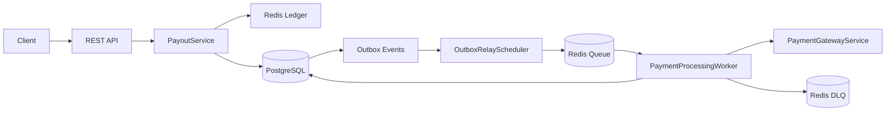
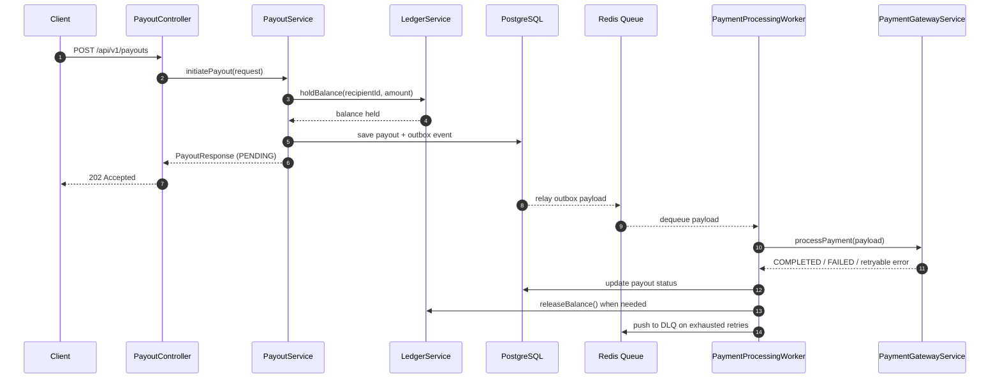

# Outbox Payment System

A Spring Boot service that simulates payout processing using the transactional outbox pattern.
The application combines PostgreSQL for durable payout and outbox persistence, Redis for balance
reservation and queueing, and scheduled workers for asynchronous payment processing.

## Overview

The service accepts payout requests through a REST API, reserves funds in a Redis-backed ledger,
persists the payout and its outbox event in a single database transaction, and then relays the outbox
event to a Redis queue for background processing. A worker consumes the queue, invokes a simulated
payment gateway, updates payout status, and releases funds when needed.

### Core capabilities

- REST API for creating and querying payouts
- Redis-backed ledger for balance hold and release operations
- Transactional outbox persistence in PostgreSQL
- Scheduled outbox relay with distributed locking via ShedLock
- Asynchronous payment processing with retry and backoff
- Dead-letter queue support for exhausted payment attempts
- Actuator endpoints for health and metrics
- Integration tests powered by Testcontainers

## Architecture



## Workflow



## Tech Stack

- Java 21
- Spring Boot 3.5.14
- Spring Web
- Spring Data JPA
- Spring Data Redis
- Spring Validation
- Spring Retry
- Spring Scheduling
- ShedLock
- Flyway
- PostgreSQL 16
- Redis 7
- Micrometer / Spring Boot Actuator
- JUnit 5, Spring Boot Test, Testcontainers

## Prerequisites

- Java 21
- Maven 3.9+ or the included Maven Wrapper
- Docker and Docker Compose

## Local Setup

### 1. Clone the repository

```bash
git clone <repository-url>
cd outbox
```

Replace `<repository-url>` with the Git URL for this project.

### 2. Start infrastructure

```bash
docker compose up -d
```

This starts:

- PostgreSQL on `localhost:5432`
- Redis on `localhost:6379`

### 3. Run the application

```bash
./mvnw spring-boot:run
```

On Windows, use:

```bash
mvnw.cmd spring-boot:run
```

### 4. Run the test suite

```bash
./mvnw test
```

On Windows, use:

```bash
mvnw.cmd test
```

## Configuration

Default runtime configuration is in [application.yaml](src/main/resources/application.yaml).

### Database

- JDBC URL: `jdbc:postgresql://localhost:5432/payment_db`
- Username: `payment_user`
- Password: `payment_pass`

### Redis

- Host: `localhost`
- Port: `6379`

### Flyway

Database migrations are stored in [src/main/resources/db/migration](src/main/resources/db/migration).
They create the `payouts` and `outbox_events` tables used by the service.

## API

Base path: `/api/v1/payouts`

| Method | Path | Description |
| --- | --- | --- |
| `POST` | `/api/v1/payouts` | Initiate a payout request. Returns `202 Accepted` with the payout record. |
| `GET` | `/api/v1/payouts/{id}` | Fetch a payout by its UUID. |
| `POST` | `/api/v1/payouts/ledger/seed?accountId={accountId}&amount={amount}` | Seed a Redis ledger balance for an account. |
| `GET` | `/api/v1/payouts/ledger/balance/{accountId}` | Read the current ledger balance for an account. |
| `GET` | `/api/v1/payouts/dlq` | List payloads currently stored in the dead-letter queue. |

### Example create payout request

```json
{
  "recipientId": "user_123",
  "amount": 5000,
  "currency": "INR",
  "idempotencyKey": "payout-req-001"
}
```

### Example payout response

```json
{
  "id": "f2f6a4d7-8d7a-4d62-8d1f-3b2b7b0a1a7c",
  "recipientId": "user_123",
  "amount": 5000,
  "currency": "INR",
  "status": "PENDING",
  "createdAt": "2026-07-04T10:00:00",
  "updatedAt": "2026-07-04T10:00:00",
  "attempts": 0
}
```

## Observability

Actuator endpoints are enabled for:

- `health`
- `info`
- `metrics`
- `loggers`

The application also publishes payout counters for initiated, completed, failed, and retry-hang outcomes.

## Testing

The test suite uses Testcontainers to run against real PostgreSQL and Redis instances.
Integration coverage includes:

- ledger hold and release operations
- payout creation with outbox event persistence
- idempotency behavior
- payout lookup failures

## Performance Results

Load tested with k6 under 100 concurrent users over 3 minutes.

| Metric | Result |
| --- | --- |
| Total Requests | 27,000+ |
| Requests / sec | ~150 |
| Avg Response Time | 41ms |
| p99 Latency | 199ms |
| Failure Rate | 0% |
| Payouts Processed | 13,500+ |

All tests were run on a local machine against real PostgreSQL and Redis instances, with no mocking or in-memory substitutes.

## Project Structure

- `controller/` - REST endpoints
- `service/` - business logic and ledger/payment services
- `scheduler/` - outbox relay job
- `worker/` - queue consumer and payment processor
- `repository/` - JPA repositories
- `domain/` - entities and enums
- `dto/` - request and response models
- `config/` - Redis and scheduling configuration
- `exception/` - API and domain exceptions
- `metrics/` - Micrometer counters

## Notes

- The payment gateway is simulated and randomly returns success, failure, or retryable hang behavior.
- The Redis ledger stores balances under keys in the form `ledger:{accountId}`.
- Queue payloads are stored under `payout:queue`, and failed payloads are moved to `payout:dlq`.

## License

No license has been specified for this repository.
